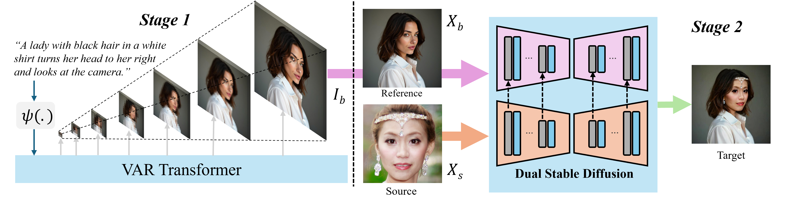
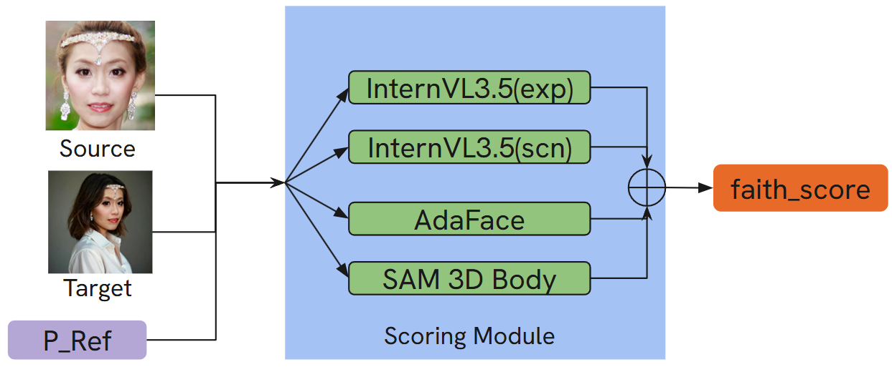
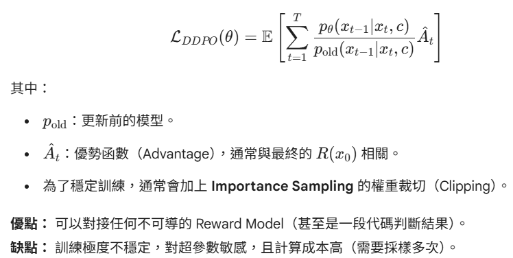
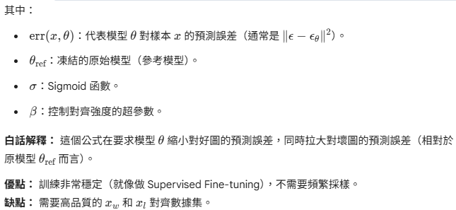
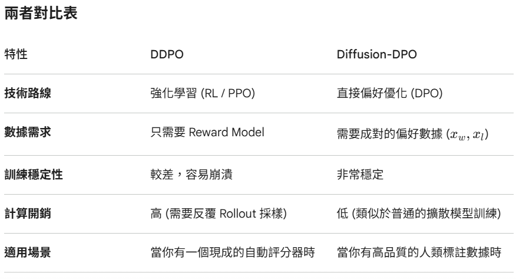
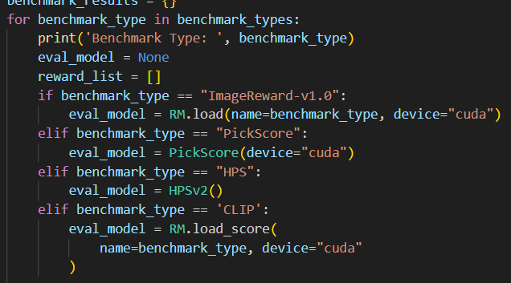
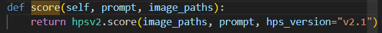
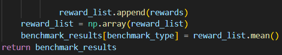

# SoftREPA Project Notes

## 1. Project Overview
SoftREPA is trained with paired COCO data and DeepFashion data.

- Paired COCO dataset: 118K images
- DeepFashion dataset: 25K images




SoftREPA also uses Diffusion-DPO (Direct Preference Optimization for Diffusion) and DDPO (Denoising Diffusion Policy Optimization).



$$
\mathcal{L}_{DPO}(\theta; \theta_{\text{ref}}) = -\mathbb{E}_{(x_w, x_l, c)} \left[ \log \sigma \left( \beta \cdot (\text{err}(x_l, \theta) - \text{err}(x_l, \theta_{\text{ref}})) - \beta \cdot (\text{err}(x_w, \theta) - \text{err}(x_w, \theta_{\text{ref}})) \right) \right]
$$





## 2. Reward Function
- Reward model selection


- Reward score


- Mean reward score



## 3. Data Path
- DeepFashion training data:
    - /media/ee303/4TB/DeepFashion_Training_Final


## 4. Pose Pipeline (Yaw/Pitch)
### 4.1 Predict yaw and pitch
- Script:
    - ./sam-3d-body/infer_v2.py
- Output CSV:
    - ./sam3-body/sam3_results.csv

### 4.2 Angle rules
- yaw > 40 or yaw < -40: turn head left/right over shoulder
- yaw > 20 or yaw < -20: turn head left/right
- -20 < yaw < 20: face forward
- pitch > 10: look up
- pitch < -10: look down

### 4.3 Map angles to posture prompts
- Script:
    - ./sam3-body/label.py


## 5. Prepare and Train T2I
### 5.1 Prepare training data
- Script:
    - ./SoftREPA/prepare_training_data_from_csv.py
- Output:
    - ./sam3-body/sam3_labeded_training/deepfashion

### 5.2 Train model
- Script:
    - ./SoftREPA/run_train_single_gpu.sh
- Output:
    - ./SoftREPA/data/deepfashion


## 6. Inference
### 6.1 SoftREPA T2I
```bash
python sample.py \
    --model sd3 --use_dc --use_dc_t True \
    --n_dc_tokens 4 --n_dc_layers 5 \
    --img_size 1024 \
    --NFE 28 --cfg_scale 4 \
    --load_dir "tokens/sd3" \
    --save_dir "generated/SoftREPA" \
    --datadir "./Generic_prompts"  # or Posture_prompts
```

### 6.2 Lumina T2I
```bash
python Lumina_inference.py \
    --input /media/ee303/4TB/SoftREPA/Posture_prompts/pose_prompts.jsonl \
    --output_dir generated/lumina/PP
```

## 7. Visualization
- Use show_image.py to visualize generated images in a grid format.
```bash
python show_image.py -f generated/SoftREPA -c 15 
python show_image.py -f generated/lumina/PP -c 15
```

## 8. Planned Benchmark
- Use 15 posture prompts to compare multiple T2I models (PhotoMaker v2, UniPortrait, PuLID, etc.)
- Metrics:
    - CLIP
    - DINO
    - HPS
    - ImageReward
    - FID (SoftREPA uses COCO-val 1K)
    - LPIPS
    - Latency
```bash
cd /media/ee303/4TB/Personalization
bash run_unified_v3.sh --folder /media/ee303/disk2/JACK/ECCV_DATA/T2I_20_prompts --swap /media/ee303/disk2/JACK/ECCV_DATA/Infinity_20prompts --name infinity_noref --output infinity_noref_metadata.json --summary-jsonl metrics_summary.jsonl
```


## 9. Runtime Reference
- Lumina: 13 seconds
- SoftREPA: 4 seconds

## 10. Prompt correction with gender, age, and pose information
```bash
bash /media/ee303/4TB/SoftREPA/tools/run_gender_race_pipeline.sh
```

## Qwen Inference
./sam3-body/qwen_infer.py
./sam3-body/qwen_batch_infer.py


## Prompt Refinement
```bash
bash /media/ee303/4TB/SoftREPA/tools/run_gender_race_pipeline.sh  /media/ee303/4TB/SoftREPA/celeb_imgs /media/ee303/4TB/SoftREPA/tools/final_prompt.csv
```

## DeepFashion Data Analysis
./sam3-body/analyze_captions.py
